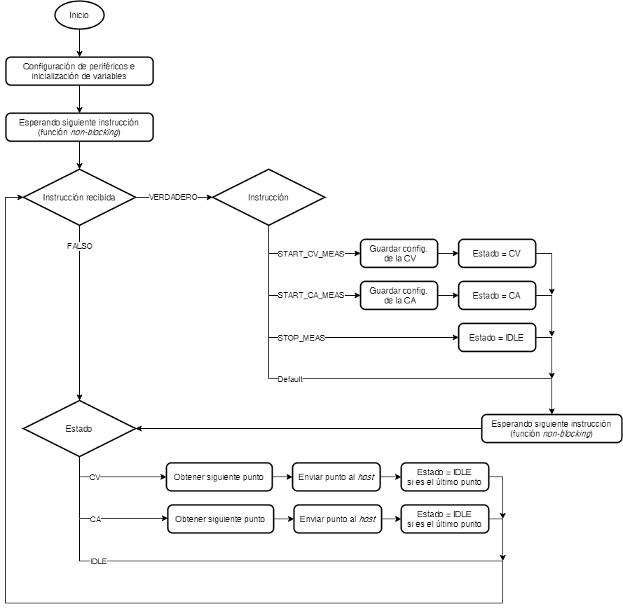
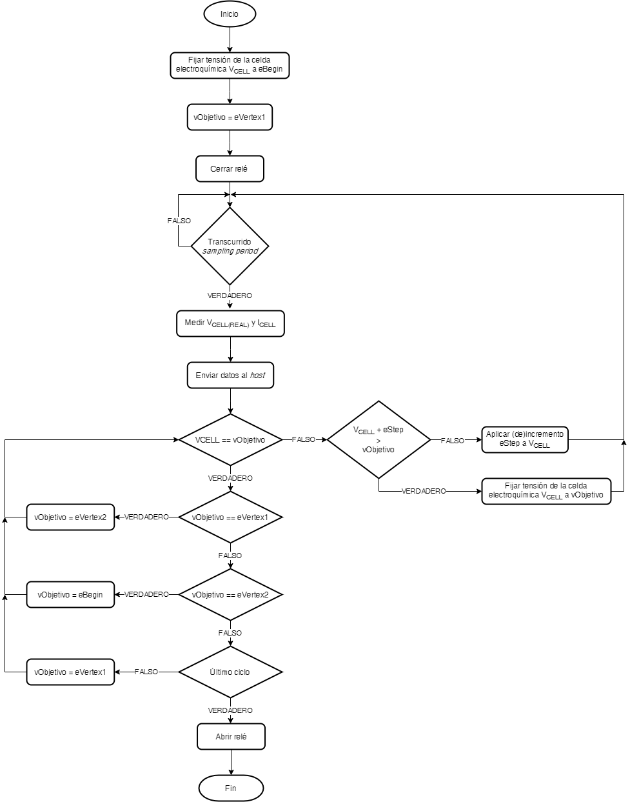

# Proyecto MASB-POT-S

</br>

## Introducción

En este proyecto programaréis un potenciostato. El potenciostato está formado por un _front-end_ específicamente diseñado para la asignatura y un _back-end_ basado en la _Evaluation Board_ (EVB) NUCLEO-F401RE de STMicroelectronics.

El objetivo del proyecto es poder realizar dos tipos de mediciones electroquímicas: voltammetría cíclica y cronoamperometría. El dispositivo será validado haciendo mediciones con una muestra de [ferricianuro de potasio](https://es.wikipedia.org/wiki/Ferricianuro_de_potasio) a diferentes concentraciones en un [tampón](https://es.wikipedia.org/wiki/Tamp%C3%B3n_qu%C3%ADmico)/_buffer_ de [cloruro de potasio](https://es.wikipedia.org/wiki/Cloruro_de_potasio).

### Voltammetría cíclica

Una [Voltammetría Cíclica (CV)](https://pubs.acs.org/doi/10.1021/acs.jchemed.7b00361) es un tipo de medición electroquímica potenciodinámica en la que se aplica un potencial variable a una celda electroquímica mientras se mide la corriente que esta celda proporciona. El potencial entre el electrodo de trabajo (WE) y el de referencia (RE) de la celda varía con el tiempo hasta que alcanza un valor potencial establecido, luego cambia de dirección, realizando lo que se denomina barrido triangular de potencial. Este proceso se repite durante un número establecido de ciclos. El resultado se representa en un voltamograma cíclico, que representa la corriente a través de la celda frente al voltaje aplicado en esta. La CV es una técnica ampliamente utilizada para estudiar las propiedades electroquímicas de un analito en una solución. Una CV proporciona gran cantidad de información sobre el comportamiento químico y físico de un sistema. Además, se pueden observar diferentes fenómenos físicos realizando voltammetrías a diferentes velocidades de exploración (modificando la velocidad de cambio de voltaje con el tiempo).

### Cronoamperometría

Una Cronoamperometría (CA) es una técnica electroquímica que transduce la actividad de las especies biológicas de una celda electroquímica en una señal de corriente que cuantifica la concentración del analito de interés. En esta técnica se aplica una señal escalón y se mide la corriente a través de la celda en función del tiempo. Una de las ventajas de esta técnica es que no requiere etiquetado de analito o biorreceptor. El experimento comienza manteniendo la celda a un potencial en el que no ocurre ningún proceso faradaico. Entonces, el potencial se eleva a un valor en el cual ocurre una reacción redox.

## Contenidos <!-- omit in toc -->

- [Proyecto MASB-POT-S](#proyecto-masb-pot-s)
  - [Introducción](#introducción)
    - [Voltammetría cíclica](#voltammetría-cíclica)
    - [Cronoamperometría](#cronoamperometría)
  - [Objetivos](#objetivos)
  - [Requerimientos](#requerimientos)
  - [Aplicación de escritorio para el _host_: viSens-S](#aplicación-de-escritorio-para-el-host-visens-s)
  - [Crear proyecto e importar código fuente](#crear-proyecto-e-importar-código-fuente)
  - [_Workflow_ en Git](#workflow-en-git)
  - [Pinout](#pinout)
  - [Modulos del _front-end_ controlados por el microcontrolador](#modulos-del-front-end-controlados-por-el-microcontrolador)
    - [_Power Management Unit (PMU)_](#power-management-unit-pmu)
    - [Relé](#relé)
    - [Potenciostato](#potenciostato)
  - [Flujos de operación](#flujos-de-operación)
    - [Aplicación](#aplicación)
    - [Microcontrolador](#microcontrolador)
    - [Voltammetría cíclica](#voltammetría-cíclica-1)
    - [Cronoamperometría](#cronoamperometría-1)
  - [Reparto de tareas](#reparto-de-tareas)
    - [Propuesta](#propuesta)
  - [Evaluación](#evaluación)
  - [Contacto](#contacto)

## Objetivos

- Programar un potenciostato portable.
- Controlar la _Power Management Unit_ (PMU) del módulo _front-end_ del potenciostato.
- Comunicarse con la aplicación viSens-S instalada con el _host_ u ordenador mediante el protocolo MASB-COMM-S.
- Realizar una voltammetría cíclica.
- Realizar una cronoamperometría.

## Requerimientos

El dispositivo debe de cumplir con una serie de requerimientos una vez programado. Esos requerimientos y sus códigos son:

<details>
<summary><i>Power Management Unit</i></summary>

- **[PMU.R001]** La PMU debe de habilitarse al incio y no volverse a deshabilitar.
</details>

<details>
<summary>Comunicación</summary>

- **[COMM.R001]** El microcontrolador debe de comunicarse con el _host_ mediante una comunicación série asíncrona con configuración 115200 8N1.
- **[COMM.R002]** La comunicación debe de estar codificada en [COBS](Docs/protocolo-de-comunicacion.md) utilizando como _term char_ el carácter `0x00`.
- **[COMM.R003]** El microcontrolador actúa como esclavo del master (_host_). Debe de atender las instrucciones indicadas en el [documento](Docs/protocolo-de-comunicacion.md) referido al juego de instrucciones de la comunicación MASB-COMM-S.
- **[COMM.R004]** Cuando el microcontrolador reciba la instrucción para iniciar una medición, el microcontrolador debe de iniciarla inmediatamente.
- **[COMM.R005] (Opcional)** Cuando el microcontrolador reciba la instrucción de `stop`, el microcontrolador debe de detener inmediatamente la medida que esté realizando en ese momento. El carácter opcional de este requerimiento hace que su no implementación no comporte penalización en la evaluación del proyecto. Por otro lado, implementarlo supondrá una valoración adicional de 1.5 puntos siempre y cuando el resto de requerimientos también se cumplan.
</details>

<details>
<summary>Otros</summary>

- **[OTR.R001]** Cuando el dispositivo no esté realizando ninguna medición, el relé que conecta el electrodo de _Counter Electrode_ (CE) debe de quedar abierto.
- **[OTR.R002]** Se debe de emular el comportamiento de Arduino creando una función `setup` y `loop` con el objetivo de modificar lo menos posible el archivo `main.c`.
</details>

## Aplicación de escritorio para el _host_: viSens-S

Podéis descargaros la aplicación que debéis de utilizar en vuestro ordenador en el siguiente [enlace](https://github.com/Albert-Alvarez/viSens-S/releases/latest). Es el archivo `viSens.Installer.zip`.

Una vez instalada, la operación de la aplicación es sencilla. A continuación tenéis un video donde se muestra su funcionamiento.

[](http://www.youtube.com/watch?v=UkXToFs8g6Y)

> Se recomienda que en el [repositorio de la aplicación](https://github.com/Albert-Alvarez/viSens-S/releases/latest), arriba del todo, activéis el seguimiento de las _releases_ des de el icono <kbd>Watch</kbd> y cliquéis en la estrella <kbd>⭐️</kbd>. De este modo, si se corrige algún _bug_ en la aplicación y se publica una nueva versión, os llegará una notificación.

> Las indicaciones del siguiente párrafo se dieron en el contexto del año pasado en el que estabamos confinados y no teniamos acceso al laboratorio. Igualmente, usadlo como indicaciones para ir haciendo pruebas hasta que podáis disponer del dispositivo.

Aunque no podamos hacer la prueba en el laboratorio, sí que podéis hacer pruebas utilizando el potenciometro que tenéis de prácticas. Haced un divisor de tensión con él y conectad el terminal variable a las entradas analógicas. Es importante también que comentéis el código relativo al DAC (I<sup>2</sup>C). Puesto que no está el DAC, el microcontrolador se quedaría congelado a la espera de recibir respuesta de él y el programa no funcionaría.

## _Workflow_ en Git

El flujo de trabajo o _workflow_ utilizado será el que se ha utilizado en anteriores desarrollos. El respositorio debe de seguir el siguiente árbol de ramas:

<p align="center">
<a href="Docs/assets/imgs/git-tree.png">

</a>
</p>

- **master:** rama que contiene el código de producción. Se entiende como código de producción aquel que se le puede entregar a un cliente y funciona 100%.
- **develop:** rama que contiene nuestro desarrollo. En esta rama se agrupan todos los desarrollos de los miembros del equipo y se testean. Una vez validado su correcto funcionamiento, los contenidos de la rama `develop` se vuelcan a la rama `master`, mediante un `Pull Request`, para entregar al cliente.
- **feature/\*\*\*:** rama que contiene el desarrollo individual o colectivo de una funcionalidad. Los asteriscos deben de ser sustituidos por un término descriptivo de la funcionalidad desarrollada en esa rama. Los contenidos de esa rama se vuelcan en la rama `develop`, mediante un `Pull Request`, una vez han sido testeados.
- **hotfix/\*\*\*:** rama que contiene la corrección de un _bug_ o comportamiento no deseado. Los asteriscos deben de ser sustituidos por un término descriptivo del _bug_ o comportamiento no deseado corregido. En función de la gravedad del _bug_ o comportamiento no deseado a corregir, los contenidos de esa rama se vuelcan en la rama `master` (si es urgente su correción) o `develop` (si su corrección puede esperar), mediante un `Pull Request`, una vez han sido testeados.

**Todos los _Pull Request_ requieren poner como revisor a los otros miembros del equipo** con tal de asegurar que todo el equipo está de acuerdo con los cambios propuestos.

Cada vez que queramos iniciar el desarrollo de una funcionalidad nueva, lo haremos creando una rama `feature/***` desde a rama `develop`. En esta rama `feature/***` **solo modificaremos archivos que hayamos creado nosotros y no generados automáticamente por STM32CubeMX**. **Esto último es muy importante**. Una vez finalizado el desarrollo y testeado, lo incorporamos a la rama `develop` con un _Pull Request_.

Si necesitamos modificar el archivo de configuración `.ioc`, lo haremos directamente en la rama `develop`. **En esta rama solo modificaremos el archivo `.ioc` y los archivos generados automáticamente por STM32CubeIDE, incluido `main.c`. Eso último es muy importante.**

**Solo una persona puede hacer modificaciones/_commits_ en la rama `develop` a la vez**. Cuando se tenga que modificar el archivo `.ioc` o un archivo generado por STM32CubeIDE, **deberéis de sentaros juntos delante de un mismo ordenador (ya sea presencial o virtualmente) y editarlo conjuntamente** (que uno le diga al otro qué es lo que necesita que se configure).

Si habéis creado la rama `feature` antes de realizar la configuración o si habéis cambiado la configuración en medio del desarrollo de una funcionalidad para corregir un error, ese cambio de configuración no estará en vuestra rama `feature`. Tendréis que hacer un `git rebase`. A continuación tenéis el _snippet_ para hacerlo:

```bash
git checkout develop
git pull
git checkout feature/***
git rebase develop
git push --force-with-lease
```

Una vez todas las funcionalidades deseadas se han incorporado a la rama `develop` y se ha comprobado que **todo funciona 100%**, se hace un _Pull Request_ a la rama `master`.

## Pinout

A continuación se detallan los pines utilizados del microcontrolador para interaccionar con el _front-end_ del potenciostato.

| Pin | Alias |         Tipo         | Descripción                                                                                                     |
| :-: | :---: | :------------------: | :-------------------------------------------------------------------------------------------------------------- |
| PA0 | VREF  |  Entrada analógica   | Tensión absoluta del _Reference Electrode (RE)_ V<sub>REF</sub> utilizada para la medición de V<sub>CELL</sub>. |
| PA1 | ICELL |  Entrada analógica   | Tensión de salida del TIA utilizada para la medición de I<sub>CELL</sub>.                                       |
| PB8 |  SCK  | I<sup>2</sup>C (SCK) | Señal SCK del I<sup>2</sup>C. Con el bus I<sup>2</sup>C se controla el DAC del _front-end_.                     |
| PB9 |  SDA  | I<sup>2</sup>C (SDA) | Señal SDA del I<sup>2</sup>C. Con el bus I<sup>2</sup>C se controla el DAC del _front-end_.                     |
| PA5 |  EN   |    Salida digital    | Señal de (des)habilitación de la PMU.<br>`0`: PMU deshabilitada. `1`: PMU habilitada.                           |
| PB5 | RELAY |    Salida digital    | Señal de control del relé.<br>`0`: Relé abierto. `1`: Relé cerrado.                                             |

> De ahora en adelante, en el guión se hará referencia a los pines por su alias.<br> Cabe diferenciar que cuando se utilicen subindices se estará haciendo referencia a la magnitud física en cuestión. Si está todo en mayúsculas, se estará haciendo referencia al pin. Por ejemplo, ICELL hace referencia al pin, I<sub>CELL</sub> a la corriente que pasa por la celda.

## Modulos del _front-end_ controlados por el microcontrolador

A continuación se describirán los diferentes módulos del _front-end_ que controla el microcontrolador.

### _Power Management Unit (PMU)_

La PMU, la unidad de gestión de potencia, es la responsable de alimentar todo el _front-end_. La PMU está deshabilitada por defecto para evitar quel el _front-end_ consuma corriente hasta que la EVB negocie con el controlador USB de nuestro ordenador un consumo máximo. Cuando esto ocurra, el microcontrolador será alimentado y podemos habilitar la PMU. La PMU se habilita a través del pin `EN`. Nada más se inicie el programa en el microcontrolador, se debe de llevar a nivel alto el pin `EN`. Una vez habilitada la PMU, esperar 500 ms hasta proseguir con la ejecución del programa para asegurar que todos los componentes del dispositivo se encuentran correctamente alimentados.

### Relé

El relé se encarga de abrir y cerrar el circuito entre el _front-end_ y el sensor electroquímico. De este modo, cuando el relé está abierto, no hay conexión electrica entre el sensor y el _front-end_. Cuando el relé está cerrado, el sensor se conecta al _front-end_. El estado por defecto del relé debe de ser abierto. Al realizarse una medición, el relé debe de cerrarse previamente. Una vez finalizada la medición, el relé debe de volver a abrirse. El relé se controla con el pin `RELAY`.

### Potenciostato

El potenciostato es el responsable de polarizar la celda electroquímica a una tensión V<sub>CELL</sub> y leer la corriente que circula por ella I<sub>CELL</sub>.

Para establecer la tensión V<sub>CELL</sub> se dispone de un DAC modelo MCP4725 con dirección I<sup>2</sup>C `1100000`. El DAC puede generar una tensión de salida de 0 a 4 V. A la salida del DAC se ha añadido una etapa que convierte esa señal unipolar de 0 a 4 V a una señal bipolar de -4 a 4 V con tal de poder polarizar la celda tanto con tensiones negativas como positivas.

Pese a que controlamos la tensión de polarización de la celda, no la podemos dar por conocida. Por ello, utilizamos el ADC del microcontrolador para leer una tensión V<sub>ADC</sub> que corresponde a la tensión del RE V<sub>REF</sub> previamente pasando por un circuito conversor de señal bipolar a unipolar. A su vez, a partir de esta tensión V<sub>REF</sub>, podemos obtener la tensión de la celda V<sub>CELL</sub>.

Finalmente, para leer la corriente a través de la celda se utiliza un amplificador de transimpedancia o TIA. La resistencia del TIA es de 50 k&#8486;. La señal también pasa por un conversor de señal bipolar a unipolar.

Se ha incorporado una librería `formulas` para realizar la conversión entre los valores leídos por el ADC a los niveles de tensión/corriente pertinente.

### Potenciometro digital

La ganancia del TIA está implementada mediante un potenciometro digital. La librería ya está incluída en el proyecto. A continuación, puede verse el código de inicalización de la librería:

```c
	I2C_init(&hi2c1);

	AD5280_Handle_T hpot = NULL;

	hpot = AD5280_Init();

	// Configuramos su direccion I2C de esclavo, su resistencia total (hay
	// diferentes modelos; este tiene 50kohms) e indicamos que funcion queremos que
	// se encargue de la escritura a traves del I2C. Utilizaremos la funcion
	// I2C_Write de la libreria i2c_lib.
	AD5280_ConfigSlaveAddress(hpot, 0x2C);
	AD5280_ConfigNominalResistorValue(hpot, 50e3f);
	AD5280_ConfigWriteFunction(hpot, I2C_write);

	// Fijamos la resistencia de 50 kohms.
	AD5280_SetWBResistance(hpot, 50e3f);
```

> Tanto el potenciometro como el DAC utilizan el I2C para comunicarse. Este periférico debe de configurarse en el fichero `.ioc`.

### Convertidor digital-analógico

El proyecto también incorpora una librería para controlar el DAC. La inicialización del mismo ser realiza mediante el siguiente código:

```c
// Declarar esta variable como global para poder
// acceder a ella desde diferentes archivos
static MCP4725_Handle_T hdac = NULL;

hdac = MCP4725_Init();
MCP4725_ConfigSlaveAddress(hdac, 0x66); // DIRECCION DEL ESCLAVO
MCP4725_ConfigVoltageReference(hdac, 4.0f); // TENSION DE REFERENCIA
MCP4725_ConfigWriteFunction(hdac, I2C_write); // FUNCION DE ESCRITURA (libreria I2C_lib)
```

Por otro lado, cada vez que queramos generar un nivel de tensión, lo hacemos con el código:

```c
MCP4725_SetOutputVoltage(hdac, vDac); // NUEVA TENSION
```

## Flujos de operación

A continuación se expondrán los flujos de ejecución a diferentes niveles de abstracción. Estos diagramas de flujo son de alto nivel, por lo que no indican todos los detalles u operaciones que tiene que hacer el microcontrolador. Son solo de referencia.

> Los diagramas de flujo que se muestren en los informes finales deberán de estar hechos con [mermaid](https://mermaid-js.github.io/mermaid/#/).

### Aplicación

El siguiente flujo corresponde a la operativa del usuario con el dispositivo y la aplicación de escritorio instalada en el _host_.

<p align="center">
<a href="Docs/assets/imgs/app-flow.png">

</a>
</p>

### Microcontrolador

El siguiente flujo corresponde a la operativa del microcontrolador en función de la instrucción recibida.

<p align="center">
<a href="Docs/assets/imgs/micro-flow.png">

</a>
</p>

### Voltammetría cíclica

El siguiente flujo corresponde a la operativa del microcontrolador a la hora de realizar una voltametría cíclica.

<p align="center">
<a href="Docs/assets/imgs/cv-flow.png">

</a>
</p>

La voltammetría cíclica consiste en hacer un barrido en tensión sobre la celda electroquímica. Esto es, empezar aplicando una tensión `eBegin` a la celda e ir aplicando incrementos/decrementos de `eStep` hasta llegar a la tensión `eVertex1`. Una vez llegados a `eVertex`, realizamos el mismo proceso hasta llegar a `eVertex2`. Por último, una vez llegado a `eVertex2`, hacemos un barrido hasta `eBegin`. Esto corresponde a un ciclo. Hay que repetir el proceso tantas veces como nos lo indique `cycles`.

El periodo entre muestras nos los indican el _scan rate_ y el _step_. El periodo entre muestras corresponde a:

<p align="center">

</p>

> En el diagrama aparece V<sub>CELL</sub> y V<sub>CELL(REAL)</sub>. El primero hace referencia a la tensión de celda que fijamos con el DAC. El segundo hace referencia a la tensión de celda realmente aplicada y que obtenemos mediante el ADC.

**IMPORTANTE:** Para favorecer la viabilidad del proyecto, se considerará únicamente que `eVertex2 < eBegin < eVertex1`. En un potenciostato real, puede darse también el caso que `eVertex1 < eBegin < eVertex2`. Implementar el caso real, es decir, que el dispositivo funcione para ambos casos, supondrá una valoración adicional de 1 punto.

### Cronoamperometría

El siguiente flujo corresponde a la operativa del microcontrolador a la hora de realizar una cronoamperometría.

<p align="center">
<a href="Docs/assets/imgs/ca-flow.png">

</a>
</p>

La cronoamperometría consiste en fijar una tensión constante en la celda electroquímica durante el tiempo indicado por `measurementTime`. Se toma una muestra con un periodo indicado por `samplingPeriodMs`.

## Reparto de tareas

El reparto de tareas es libre. Podéis repartiros las tareas como creáis conveniente. Se utilizará el usuario indicado en los cambios en GitHub como indicador de quién ha hecho ese trabajo/cambio. Esto último se puede ver desde la pestaña `Insights` de vuestro repositorio en el apartado `Contributors`.

> **Importante.** Más línias de código/_commits_ no indica necesariamente más trabajo realizado. Se puede ser muy eficiente y realizar el mismo trabajo con menos línias utilizando código optimizado. Esto se tendrá en cuenta.

### Propuesta

Si los miembros del equipo de trabajo necesitasen una propuesta inicial de reparto de tareas, se puede disponer de la siguiente:

<details>
<summary>Miembro A</summary>

- Configuración del archivo `.ioc` y generación del código.
- Creación de las funciones `setup` y `loop`, y modificación de la función `main`.
- Gestión de la cronoamperometría.
- Gestión del DAC.
</details>

<details>
<summary>Miembro B</summary>

- Control de la PMU.
- Gestión de la voltammetría cíclica.
- Gestión de _timers_.
- Gestión de ADCs.
</details>

> Es una propuesta y se puede modificar a conveniencia siempre y cuando se realice un reparto equitativo de las cargas de trabajo.

## Evaluación

Los entregables del proyecto son:

- Repositorio en GitHub con el proyecto desarrollado y que compile sin errores.
- Informe en Markdown con una descripción del proyecto y el trabajo realizado.

Ambos se evaluarán siguiendo la rúbrica que encontraréis en el Campus Virtual para tal efecto. Todos los entregables son imprescindibles para poder superar el proyecto.

> En el primer entregable se especifica que **el proyecto debe de compilar sin errores**. No se puede presentar un proyecto con errores de compilación. Puede tener funcionalidades que no estén bien hechas, código o configuraciones erróneos, código sin comentarios, etc., que luego se evaluarán en consecuencia. Pero no puede contener errores de compilación. **Un proyecto con errores de compilación no será evaluado y supondrá la no superación del proyecto**.<br>Aunque se evaluará el correcto uso de Git, GitHub y el _workflow_, el código que se evaluará es el disponible en la rama `master`. Ese es el que no tiene que tener errores de compilación.

El informe debe de cumplir con los siguientes requerimientos:

- Se crearán dos informes: uno en castellano y otro en inglés. Ambos iguales y con el mismo contenido. Simplemente en dos idiomas.
- El lenguage debe de ser formal.
- Se crearán en la misma carpeta que el presente documento con el nombre `REPORT_ES.md` y `REPORT_EN.md`.
- El objetivo final del informe es ser colgado en la página web de la asignatura, por lo que debe de seguir el formato típico de una página web (texto, hypervínculos, imágenes, medios audiovisuales, etc.). (Se verá en clase cómo proceder para subir el informe en la página).
- Mientras que los puntos/apartados del informe son libres, el informe debe de contener:

  - Una introducción al proyecto (en qué consiste, qué es un potenciostato, cuáles son los objetivos, en qué consisten las medidas electroquímicas que hay que hacer y para qué sirven,...).
    Git/GitHub.
  - Un diagrama de flujo y una explicación de vuestra aplicación final (que puede ser parecido o no al de este guión).
  - Los resultados obtenidos.
  - Conclusiones extraídas tanto del proyecto como de la asignatura.

  Se hace hincapié en que los puntos/apartados del informe son libres (por ejemplo, puede haber la introducción al principio del informe sin necesidad de que haya un encabezado que diga "Introducción").

- En la carpeta `Docs/assets/imgs` debe de haber una fotografía reciente de cada miembro del equipo de trabajo nombrada siguiendo el siguiente formato `NOMBRE-APELLIDO1-APELLIDO2.jpg`. La foto, en formato `.jpg`, ha de ser cuadrada de tipo retrato y con un tamaño mínimo de 400 x 400 pixels y un máximo de 8 MB. Tenéis que aparecer claramente identificables.
- Los recursos utilizados en el informe (imágenes, GIFs, etc.) deben de guardarse en la carpeta `Docs/assets`.
- De manera opcional, al principio del informe, indicad correos o perfiles de redes sociales (LinkedIn, Twitter, Instagram, etc.) donde queráis que os contacten/encuentren los lectores de vuestro informe. [Comentad esa porción del informe](https://alvinalexander.com/technology/markdown-comments-syntax-not-in-generated-output/) y cuando se traslade el informe a la web se añadirán esos datos como datos de contacto en la página.

## Contacto

El canal de comunicación principal será el [repositorio masb](https://github.com/TheAlbertDev/MASB/discussions) con el objetivo de que podáis colaborar entre vosotros y que la información esté disponible para todos.

Si es necesario, y previa cita, se puede realizar una reunión presencial/virtual entre el gestor del proyecto y uno o más equipos de trabajo.
